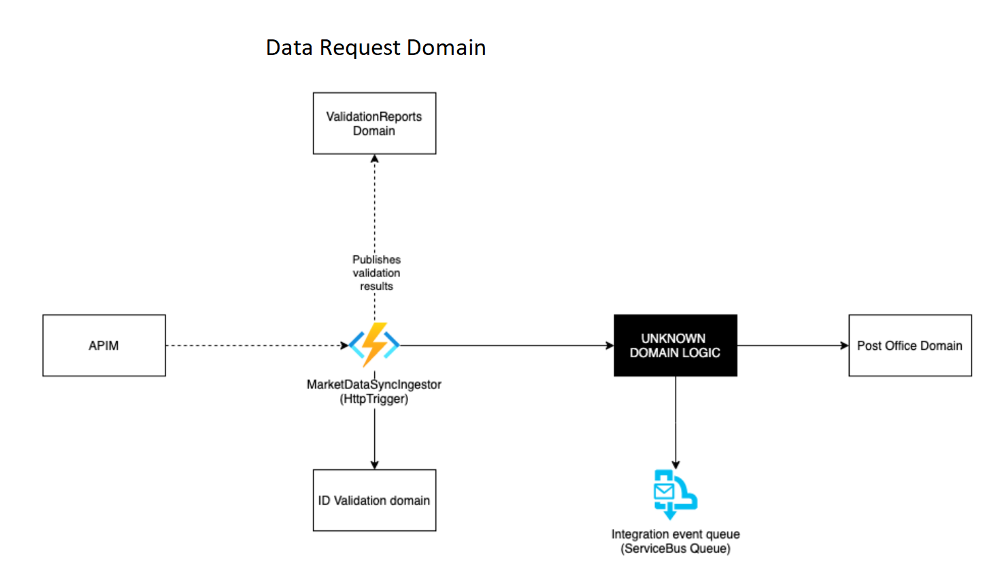
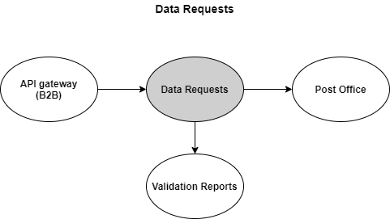

# Data Requests

## Intro

The purpose of the Data Requests domain is to receive and process incoming data requests from Market Participants.

These are the business processes expected to be maintained by this domain.

| Processes |
| ------------- |
| [Master data request](docs/business-processes/master-data-request.md) |
| ... |

## Architecture

## Context Streams

This sections documents the dataflows to and from the data requests domain.

## Domain Road Map

No work planned in current program increment.

## Getting Started

Learn how to get started with Green Energy Hub [here](https://github.com/Energinet-DataHub/green-energy-hub/blob/main/docs/getting-started.md).

## Where can I get more help?

Read about the community for Green Energy Hub [here](https://github.com/Energinet-DataHub/green-energy-hub/blob/main/COMMUNITY.md) and learn about how to get involved and get help.

Please note that we have provided a [Dictionary](https://github.com/Energinet-DataHub/green-energy-hub/tree/main/docs/dictionary-and-concepts) to help understand many of the terms used throughout the repository.
